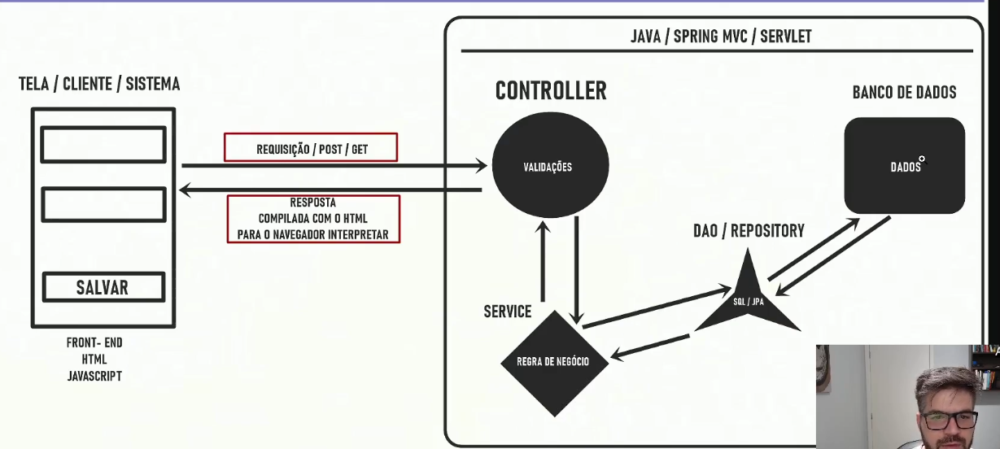

# MVC
é um padrão de arquitetura de software que busca separar responsabilidades dentro da aplicação
## Model
**"Que dados/conceitos existem no meu domínio?"**
representa o domínio/dados e as regras relacionadas a esses dados
o model são as classes responsáveis por trafegar as informações, uma classe que representa uma tabela no banco de dados,
são os modelos de negócio
## Views
**"Como apresento isso ao usuário?"**
seria o front de um site, a tela, cada vez que fizemos uma rquisição(uma ação) essa ação é interceptada por um **Controller**
Interação com o usuário
## Controller
Une os dados do model com a interação do usuário na view, faz o controle de fluxo do sistema mesmo
faz as validações nos dados que vem da tela
**"O que o usuário está tentando fazer?"**
## Service
Contem as regras e operações de negócio da aplicação
o Controller chama o service para executar uma operação.

## Repository / DAO
Responsável pelo acesso e persistência dos dados, faz a comunicação com o banco

# Fluxo
            USUÁRIO
            │
            ▼
    ┌──────────────┐
    │     VIEW     │
    │ apresentação │
    └──────┬───────┘
            │
            ▼
    ┌──────────────┐
    │  CONTROLLER  │
    │   fluxo      │
    └──────┬───────┘
            │
            ▼
    ┌──────────────┐
    │   SERVICE    │
    │    regras    │
    │   negócio    │
    └──────┬───────┘
            │
            ▼
    ┌──────────────┐
    │ REPOSITORY   │
    │ / DAO        │
    │ persistência │
    └──────┬───────┘
            │
            ▼
    ┌──────────────┐
    │   DATABASE   │
    └──────────────┘

E o resultado retorna pelo caminho inverso.

            MVC
            │
    ┌──────┴──────┐
    │             │
    VIEW       CONTROLLER
                    │
                    ▼
                SERVICE
                    │
                    ▼
            REPOSITORY
                    │
                    ▼
            DATABASE